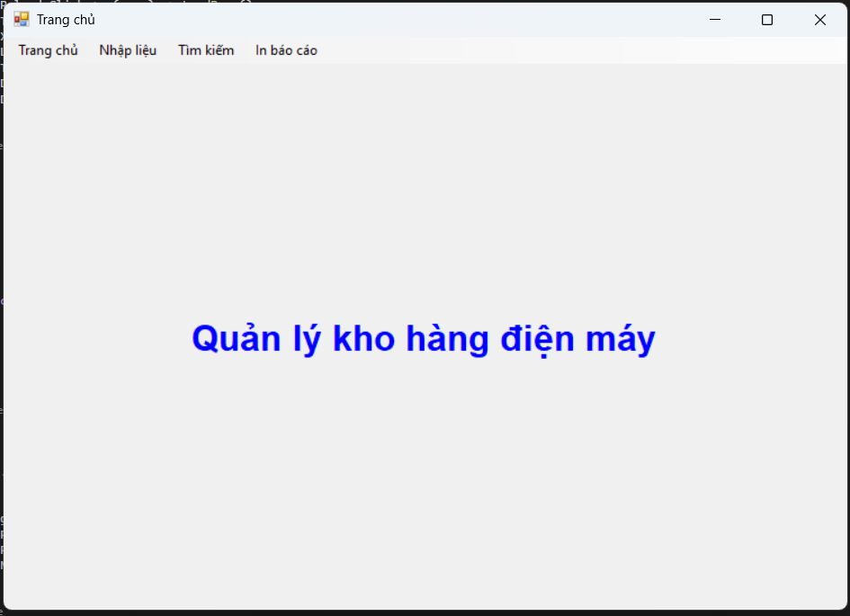
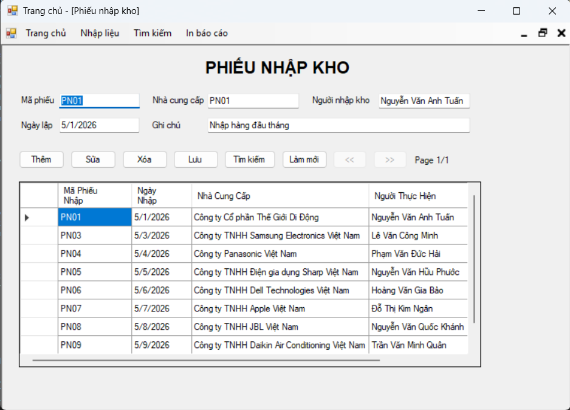
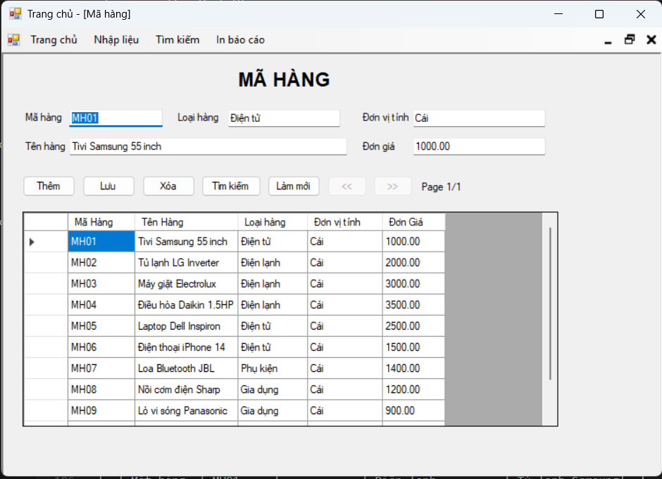
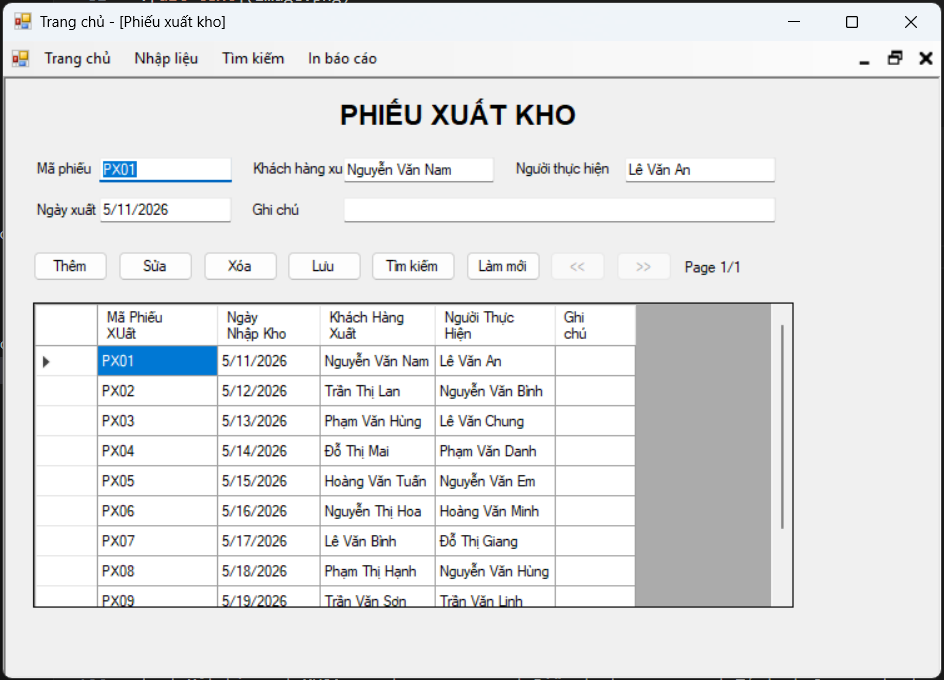
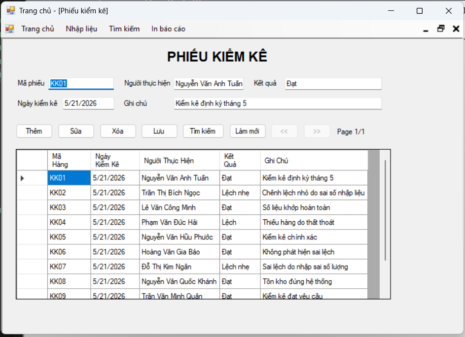
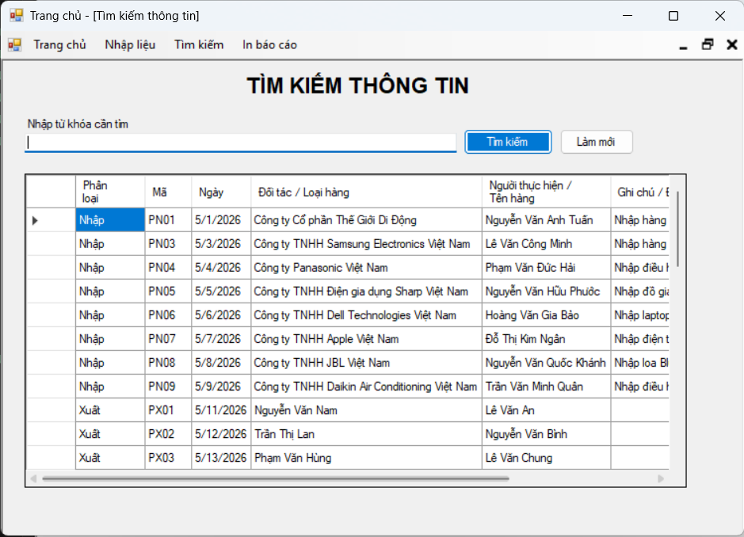
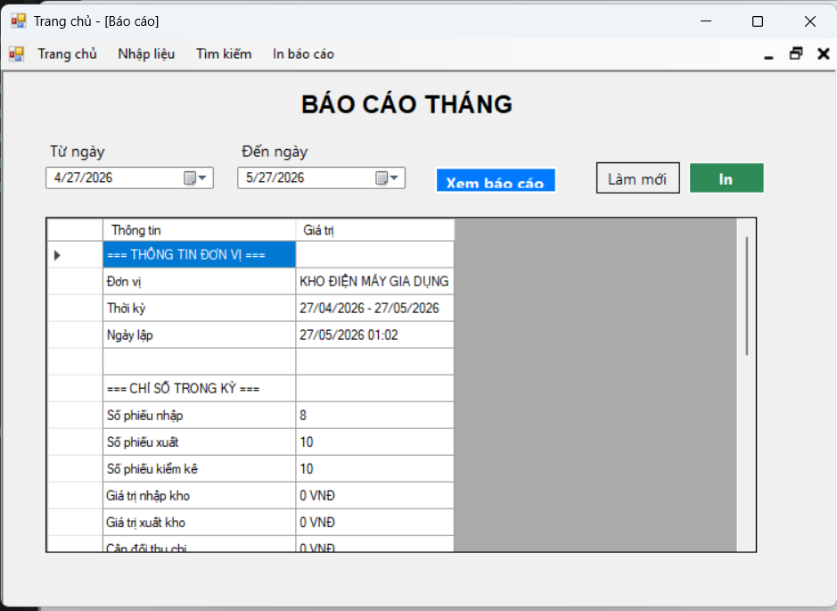

# Hệ Thống Quản Lý Kho Điện Máy Gia Dụng (KHODIENMAY)

Hệ thống **Quản lý Kho Điện máy** là một ứng dụng máy tính (Desktop Application) được phát triển bằng ngôn ngữ **C#** trên nền tảng **.NET Framework 4.7.2** và hệ quản trị cơ sở dữ liệu **SQL Server**. Hệ thống phục vụ việc theo dõi, nhập, xuất, kiểm kê hàng hóa, tra cứu tổng hợp và kết xuất báo cáo in ấn chuyên nghiệp cho một kho hàng điện máy gia dụng.

---

## 🗺️ Kiến Trúc Hệ Thống & Công Nghệ

* **Ngôn ngữ lập trình:** C# (phiên bản .NET Framework 4.7.2)
* **Giao diện người dùng:** Windows Forms (WinForms) thiết kế theo mô hình **MDI (Multiple Document Interface)** - Giao diện đa cửa sổ trong một khung làm việc chính.
* **Cơ sở dữ liệu:** SQL Server (sử dụng thư viện `System.Data.SqlClient` kết nối trực tiếp thông qua lớp tiện ích `DatabaseHelper.cs`).
* **Tính năng tối ưu:**
  * **Dynamic Column Mapping (Khớp cột động):** Hệ thống có cơ chế tự động dò tìm tên cột thực tế trong cơ sở dữ liệu (ví dụ: khớp `Ma Hàng`, `MaHang`, `MaMH`...) để tránh lỗi xung đột bảng mã tiếng Việt khi cài đặt trên các môi trường SQL Server khác nhau.
  * **Phân trang dữ liệu (Pagination):** Sử dụng các câu lệnh `OFFSET` và `FETCH NEXT` phía SQL Server kết hợp với `BindingSource` giúp ứng dụng tải dữ liệu cực nhanh, không gây tràn bộ nhớ khi kho hàng có hàng vạn bản ghi.

---

## 🗄️ Thiết Kế Cơ Sở Dữ Liệu (Database Schema)

Cơ sở dữ liệu của hệ thống bao gồm các bảng chính quản lý danh mục và nghiệp vụ kho hàng:

### 1. Bảng Mặt Hàng (`MATHANG`)
Quản lý danh sách các mặt hàng điện máy hiện có trong kho.
* `Ma Hàng` (`VARCHAR(20)`, Khóa chính)
* `Tên Hàng` (`NVARCHAR(200)`)
* `Loại Hàng` (`NVARCHAR(100)`)
* `Đơn vị tính` (`NVARCHAR(30)`)
* `Đơn Giá` (`DECIMAL(18, 2)`)

### 2. Phân hệ Nhập Kho
* **`PHIEUNHAPKHO` (Phiếu nhập):**
  * `Mã Phiếu Nhập` (`VARCHAR(20)`, Khóa chính)
  * `Ngày Nhập` (`DATETIME`, mặc định là ngày hiện tại)
  * `Nhà Cung Cấp` (`NVARCHAR(200)`)
  * `Người Thực Hiện` (`NVARCHAR(100)`)
  * `Ghi Chú` (`NVARCHAR(250)`)
* **`CT_PHIEUNHAP` (Chi tiết nhập):**
  * `MaPhieuNhap` (`VARCHAR(20)`, Khóa ngoại tham chiếu tới `PHIEUNHAPKHO`)
  * `MaHang` (`VARCHAR(20)`, Khóa ngoại tham chiếu tới `MATHANG`)
  * `SoLuongNhap` (`INT`)
  * `DonGiaNhap` (`DECIMAL(18, 2)`)
  * `ThanhTienNhap` (Cột tính toán tự động: `SoLuongNhap * DonGiaNhap`)

### 3. Phân hệ Xuất Kho
* **`PHIEUXUATKHO` (Phiếu xuất):**
  * `Mã Phiếu Xuất` (`VARCHAR(20)`, Khóa chính)
  * `Ngày Nhập Kho` (`DATETIME`, mặc định là ngày hiện tại)
  * `Khách Hàng Xuất` (`NVARCHAR(200)`)
  * `Người Thực Hiện` (`NVARCHAR(100)`)
  * `Ghi Chú` (`NVARCHAR(250)`)
* **`CT_PHIEUXUAT` (Chi tiết xuất):**
  * `Ma Phiếu Xuất` (`VARCHAR(20)`, Khóa ngoại tham chiếu tới `PHIEUXUATKHO`)
  * `MaHang` (`VARCHAR(20)`, Khóa ngoại tham chiếu tới `MATHANG`)
  * `SoLuongXuat` (`INT`)
  * `DonGiaXuat` (`DECIMAL(18, 2)`)
  * `ThanhTienXuat` (Cột tính toán tự động: `SoLuongXuat * DonGiaXuat`)

### 4. Phân hệ Kiểm Kê
* **`PHIEUKIEMKE` (Phiếu kiểm kê):**
  * `Mã Hàng` (`VARCHAR(20)`, Khóa chính - Đại diện cho Mã phiếu kiểm kê)
  * `Ngày Kiểm Kê` (`DATETIME`, mặc định ngày hiện tại)
  * `Người Thực Hiện` (`NVARCHAR(100)`)
  * `Kết Quả` (`NVARCHAR(100)`)
  * `Ghi Chú` (`NVARCHAR(250)`)
* **`CT_KIEMKE` (Chi tiết kiểm kê):**
  * `MaKiemKe` (`VARCHAR(20)`, Khóa ngoại tham chiếu tới `PHIEUKIEMKE`)
  * `MaHang` (`VARCHAR(20)`, Khóa ngoại tham chiếu tới `MATHANG`)
  * `TonKhoTheoSoSach` (`INT`)
  * `TonKhoTheoThucTe` (`INT`)
  * `ChenhLech` (Cột tính toán tự động: `TonKhoTheoThucTe - TonKhoTheoSoSach`)

---

## 🖥️ Bố Cục & Giao Diện Các Màn Hình Hệ Thống

Dưới đây là mô phỏng trực quan bố cục giao diện của các màn hình chức năng chính trong ứng dụng giúp người vận hành dễ dàng làm quen.

### 1. Giao Diện Chính (Form1 - MDI Dashboard Container)
Đây là màn hình lớn bao bọc toàn bộ hệ thống. Thanh Menu ở phía trên cho phép truy cập nhanh vào các phân hệ. Khi click vào một menu, màn hình tương ứng sẽ được mở ở trạng thái cực đại hóa (Maximized) ngay trong lòng khung làm việc chính.



### 2. Màn Hình Quản Lý Hàng Hóa (FormMatHang)
Màn hình quản lý thông tin các thiết bị điện máy trong kho. Tích hợp thanh phân trang dữ liệu và bảng điền thông tin chi tiết.


### 3. Màn Hình Quản Lý Phiếu Nhập / Phiếu Xuất
Giao diện quản lý các hóa đơn chứng từ nhập/xuất kho thực tế. Liên kết trực tiếp với thông tin nhân viên giao dịch và kiểm tra trạng thái tồn.





### 4. Màn Hình Tìm Kiếm Tổng Hợp (FormTimKiem)
Một tính năng đặc sắc của phần mềm: Cho phép gõ bất kỳ từ khóa nào để tìm kiếm đồng thời trên cả 4 bảng trong cơ sở dữ liệu. Kết quả trả về được định dạng thống nhất về một bảng duy nhất, cho phép lọc nhanh danh mục dữ liệu.


### 5. Phân Hệ Xem Trước & In Ấn Báo Cáo (FormInBaoCao)
Hỗ trợ kiểm tra các hoạt động kho hàng trong kỳ (Từ Ngày -> Đến Ngày) và kết xuất dưới dạng hóa đơn in chuẩn A4 (có xem trước đồ họa trước khi in ấn vật lý).




## 🛠️ Hướng Dẫn Cài Đặt & Cấu Hình

Để ứng dụng có thể biên dịch và chạy thành công trên máy tính của bạn, hãy thực hiện theo các bước sau:

### Bước 1: Khởi tạo Cơ sở dữ liệu (SQL Server)
1. Mở công cụ **SQL Server Management Studio (SSMS)**.
2. Kết nối tới SQL Server Engine của bạn (ví dụ: `.`, `localhost`, hoặc `SQLEXPRESS`).
3. Mở file mã nguồn SQL tại địa chỉ: `[Thư mục dự án]/Data/KHODIENMAY.sql`.
4. Nhấn **F5** hoặc chọn **Execute** để khởi tạo database `KHODIENMAY`, các bảng cấu trúc dữ liệu và nạp dữ liệu mẫu thử nghiệm.

### Bước 2: Cấu hình Chuỗi Kết Nối
1. Tìm và mở file [App.config](file:///c:/Users/kmbb2/source/repos/qu%E1%BA%A3n%20l%C3%BD%20kho/qu%E1%BA%A3n%20l%C3%BD%20kho/App.config) nằm ở thư mục gốc của dự án.
2. Chỉnh sửa tham số `connectionString` trong phần `<connectionStrings>` để phù hợp với máy của bạn.
   * Ví dụ kết nối Local Windows Authentication (mặc định):
     ```xml
     <add name="DefaultConnection" connectionString="Data Source=.;Initial Catalog=KHODIENMAY;Integrated Security=True" providerName="System.Data.SqlClient" />
     ```
   * Nếu SQL Server của bạn có tài khoản đăng nhập (SQL Server Authentication), hãy đổi thành:
     ```xml
     <add name="DefaultConnection" connectionString="Data Source=.;Initial Catalog=KHODIENMAY;User ID=your_username;Password=your_password" providerName="System.Data.SqlClient" />
     ```

### Bước 3: Build & Chạy Dự Án
1. Mở file giải pháp dự án (`quản lý kho.csproj` hoặc file `.sln` nếu có) bằng phần mềm **Visual Studio** (Khuyến nghị bản 2019 hoặc 2022).
2. Nhấn nút **Start (F5)** trên thanh công cụ Visual Studio để biên dịch và bắt đầu chạy ứng dụng.

---

## 📂 Danh Mục Cấu Trúc Mã Nguồn

* [Form1.cs](file:///c:/Users/kmbb2/source/repos/qu%E1%BA%A3n%20l%C3%BD%20kho/qu%E1%BA%A3n%20l%C3%BD%20kho/Form1.cs): Khung làm việc MDI chứa các menu chức năng.
* [Views/](file:///c:/Users/kmbb2/source/repos/qu%E1%BA%A3n%20l%C3%BD%20kho/qu%E1%BA%A3n%20l%C3%BD%20kho/Views): Thư mục chứa các form quản lý nghiệp vụ chi tiết.
  * [FormMatHang.cs](file:///c:/Users/kmbb2/source/repos/qu%E1%BA%A3n%20l%C3%BD%20kho/qu%E1%BA%A3n%20l%C3%BD%20kho/Views/FormMatHang.cs): Quản lý danh mục mặt hàng.
  * [FormPhieuNhapKho.cs](file:///c:/Users/kmbb2/source/repos/qu%E1%BA%A3n%20l%C3%BD%20kho/qu%E1%BA%A3n%20l%C3%BD%20kho/Views/FormPhieuNhapKho.cs): Lập phiếu nhập kho.
  * [FormPhieuXuatKho.cs](file:///c:/Users/kmbb2/source/repos/qu%E1%BA%A3n%20l%C3%BD%20kho/qu%E1%BA%A3n%20l%C3%BD%20kho/Views/FormPhieuXuatKho.cs): Lập phiếu xuất kho.
  * [FormPhieuKiemKe.cs](file:///c:/Users/kmbb2/source/repos/qu%E1%BA%A3n%20l%C3%BD%20kho/qu%E1%BA%A3n%20l%C3%BD%20kho/Views/FormPhieuKiemKe.cs): Kiểm kê chênh lệch hàng hóa thực tế và sổ sách.
  * [FormTimKiem.cs](file:///c:/Users/kmbb2/source/repos/qu%E1%BA%A3n%20l%C3%BD%20kho/qu%E1%BA%A3n%20l%C3%BD%20kho/Views/FormTimKiem.cs): Khung tìm kiếm tích hợp xuyên suốt toàn bộ CSDL.
  * [FormInBaoCao.cs](file:///c:/Users/kmbb2/source/repos/qu%E1%BA%A3n%20l%C3%BD%20kho/qu%E1%BA%A3n%20l%C3%BD%20kho/Views/FormInBaoCao.cs): Tổng hợp dữ liệu tài chính trong kỳ, hỗ trợ Xem trước và In ấn (Print Preview).
* [Data/](file:///c:/Users/kmbb2/source/repos/qu%E1%BA%A3n%20l%C3%BD%20kho/qu%E1%BA%A3n%20l%C3%BD%20kho/Data):
  * [DatabaseHelper.cs](file:///c:/Users/kmbb2/source/repos/qu%E1%BA%A3n%20l%C3%BD%20kho/qu%E1%BA%A3n%20l%C3%BD%20kho/Data/DatabaseHelper.cs): Tiện ích quản lý kết nối, truy vấn phân trang, chạy lệnh SQL phi truy vấn.
  * [KHODIENMAY.sql](file:///c:/Users/kmbb2/source/repos/qu%E1%BA%A3n%20l%C3%BD%20kho/qu%E1%BA%A3n%20l%C3%BD%20kho/Data/KHODIENMAY.sql): Mã nguồn khởi tạo cơ sở dữ liệu và dữ liệu ban đầu.
